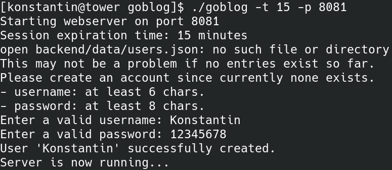
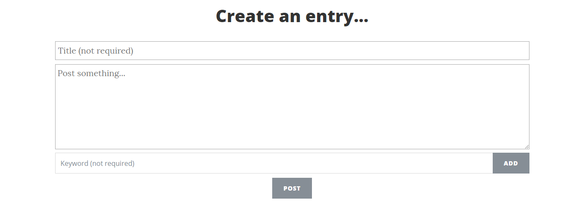
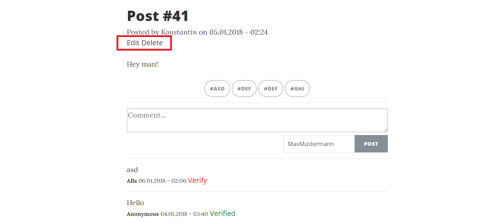
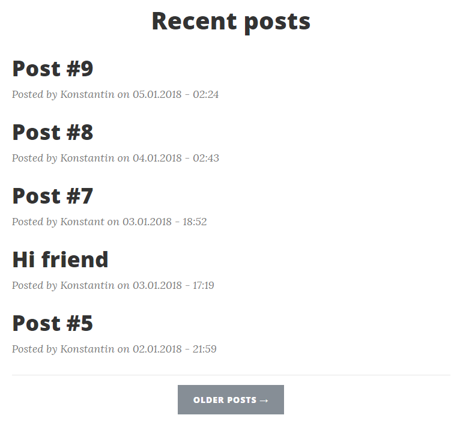
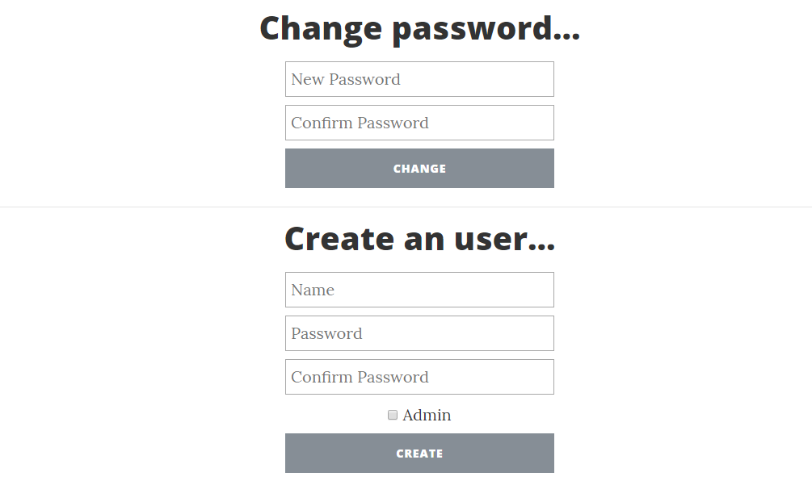

[](https://travis-ci.com/kherud/goblog)

# Anwendung

Der Webserver wird mittels der Main-Funktion gestartet. Hierbei kann die Zeit einer Authentifizierungssitzung in Minuten (t) und der für den Webserver verwendete Port (p) mittels Startparametern konfiguriert werden. Nach dem Kompilieren der Source-Dateien findet dies beispielsweise wie folgt statt:

```
go build goblog
goblog -t 15 -p 8081
```

Beim ersten Start existiert zu diesem Zeitpunkt noch kein Account, weshalb vor dem Start des Webservers ein Account per Konsole angelegt werden muss. Folgende Abbildung zeigt diesen Vorgang: Anschließend wird der Webserver auf dem gewünschten Port gestartet und ist mittels HTTPS Verbindungen erreichbar. Hierfür wurde exemplarisch ein selbstsigniertes Zertifikat erstellt.



Beim ersten Start des Webservers existieren noch keine Blog-Einträge. Folglich muss sich der Autor mit seinem zuvor erstellten Account anmelden, um einen Eintrag erstellen zu können.


Nach erfolgreicher Authentifizierung hat der Autor nun mehr Möglichkeiten zur Auswahl.


“User” leitet ihn hierbei zu einer Seite weiter, die das Ändern des eigenen Passworts ermöglicht und im Falle des Administratorenstatus das Erstellen weiterer Accounts erlaubt. “New Post” öffnet die Seite zur Erstellung neuer Blog-Einträge. “Logout” beendet die aktive Authentifizierungssitzung.

Um den Blog mit Einträgen zu füllen wird also zunächst die Seite zur Erstellung neuer Einträge geöffnet.



Hier kann neben dem eigentlichen Text ein optionaler Titel angegeben werden. Wird dieser ausgelassen, wird er automatisch um “Post #X” ergänzt, wobei X den Erstellungsindex angibt, also beispielsweise “Post #7”. Zusätzlich können beliebig viele Schlüsselwörter ergänzt werden, welche die spätere Suche nach Einträgen mit gleichen Schlüsselwörtern ermöglichen. Hat der Autor seine Eingaben getätigt und den Eintrag erstellt, wird er zu dessen Ansicht weitergeleitet.



Da es sich um seinen eigenen Beitrag handelt, werden ihm die Optionen geboten den Eintrag zu bearbeiten oder zu löschen. Zusätzlich werden die zuvor angegebenen Schlüsselwörter dargestellt, welche angeklickt werden können, um die Suche zu starten.
Verfassen Leser Kommentare zu diesem Eintrag werden sie zunächst nicht veröffentlicht. Beliebige Autoren haben die Möglichkeit diese zu verifizieren, damit sie öffentlich dargestellt werden. Hierbei werden alle Kommentare in ihrer zeitlichen Reihenfolge absteigend augelistet. Leser können anonym Kommentare verfassen oder einen Pseudonym angeben, das mittels eines Cookie gespeichert wird und zum Komfort des Lesers später vorausgewählt wird.
Wurden mehrere Einträge erstellt, zeigt die Indexseite eine Übersicht über die zuletzt erstellten. Hierbei werden vorerst fünf Eintrag-Vorschauen dargestellt, allerdings kann der Nutzer mit dem Button “Older Posts” zu älteren Einträgen navigieren, sollten noch mehr Einträge existieren. Die Einträge werden per Ajax nachgeladen, sodass die Seite nicht neu geladen werden muss.



Unautorisierte Nutzer, also Leser, können lediglich Einträge einsehen, zu diesen Kommentare verfassen und verifizierte Kommentare betrachten. angemeldete Autoren können zudem Einträge verfassen, Kommentare verifizieren, eigene Einträge bearbeiten und löschen sowie ihr Passwort ändern. Haben Accounts den Administratorenstatus können zusätzlich neue Accounts angelegt werden.




# Dokumentation

- **backend**: Bildet die Persistenz- und Backendlogik ab. Dient vor allem der Verwaltung von Speicher- und Ladevorgängen der physischen Daten.
    - **data**: Verzeichnis zur Ablage der entstehenden physischen Daten. Im Betrieb befinden sich hier zwei Dateien: “users.json” und “entries.json”.
    - **models**: Dieses Verzeichnis dient der Verwaltung der Persistenzmodelle, also der logischen Strukturierung der zu speichernden Daten. In der Entwicklung sind hier drei Modelle enstanden**: “comment.go” und “entry.go”, welche in “entries.json” gespeichert werden, und “user.go”, das in “users.json” gespeichert wird.
    - **postControlling**: Logik zum Speichern, Ändern und Löschen von Blog-Einträgen und Nutzerkommentaren.
    - **userControlling**: Logik zum Speichern und Ändern der Autorenaccounts.
    - **storageControlling**: Verwaltung der Lade- und Persistierungsvorgänge.
    - **authentication**: Authentifizierungslogik, wie Beginn und Beendigung einer Nutzersitzung sowie Validierung bestehender Sitzungen.
- **webserver**: Verwaltung des Webservers, Dirigierung eingehender Anfragen und Verarbeitung logischer Daten zur visuellen Auslieferung.
    - **static**: Verzeichnis mit allen statischen Cascading Style Sheet und JavaScript Dateien sowie Bildern. Beinhaltet Informationen des verwendeten Frontend-Frameworks “Bootstrap 3”.
    - **templates**: Beinhaltet die HTML-Templates zur dynamischen Auszeichnung von Daten mittels des Go-eigenen Templating-Systems.
    - **handleRequest**: Starten des Webservers, Weiterleitung eingehender Anfragen um entsprechende Daten aus dem Backend zu Laden und Zusammensetzen sowie Ausliefern der Templates.
- **config**: Ort zur Konfiguration verschiedener Parameter, die im wesentlichen folgende Punkte umfassen: Ablageverzeichnis der physischen Daten, Testdatenverzeichnis, Zeit bis zur Beendigung einer Authentifizierungssession, Anzahl ausgelieferter Blog-Einträge pro Anfrage, Account-Voraussetzungen, Verzeichnis der dynamischen und statischen Frontend-Dateien und Port des Webservers. Die Anwendung wurde nur mit den eingetragenen Standardwerten getestet.
- **util**: Verschiedene Hilfsfunktion, wie beispielsweise die Auslesung von Konsoleneingaben zur Erstellung eines initialen Nutzers und verschiedene Hashingprozeduren.


## Anwendungsebene

Den Einstiegspunkt der Anwendung stellt die Datei “handleRequest.go” dar. Hier wird der Server mittels des Go-internen “http”-Pakets auf dem dafür vorhergesehenen Port gestartet, wobei ausschließlich auf HTTPS-Verbindungen gelauscht wird. Hierfür wurden lediglich selbstsignierte Zertifikate verwendet. Den zentralen Punkt zur Dirigierung eingehender Anfragen stellt die http.HandleFunc “returnContent” dar. Diese Funktion führt einen Musterabgleich des ersten GET-Parameters der Anfrage durch und leitet die Anfrage entsprechend weiter. Die Prozedur zur Verarbeitung einer Anfrage in “handleRequest.go” lässt sich so in folgende Schritte unterteilen:

1. Angefragte Funktion mittels des ersten GET-Parameter bestimmen (returnContent). Im Falle einer Ajax-Anfrage direkt mit dem Ergebnis des Backends antworten (z.B. Erfolgsstatus eines Blog-Eintrag-Löschversuchs).
2. Ansonsten Authentifizierungsbedarf sowie -status überprüfen und Anfrage gegebenenfalls umleiten.
3. Anschließend die Templates für die zuvor bestimmte Seite laden (assembleTemplate).
4. Für die Templates benötigte Daten aus dem Backend laden (getPageVars).
5. Template zusammensetzen und ausliefern.

Die Logik des Backends untergliedert sich in drei unterschiedliche Teile, die größtenteils voneinander unabhängig sind: “postControlling.go”, “userControlling.go” und “authenticate.go”. Deren Grundlage bildet ein vierter Teil “storageControlling.go”, der dem physischen Speichern und Laden von Daten dient. “postControlling.go” widmet sich der Verwaltung von Blog-Einträgen inklusive deren Kommentaren und ”userControlling.go” beinhaltet Funktionen zur Verwaltung der Autorenaccounts. Accounts können zusätzlich einen Administratorenstatus besitzen, der es erlaubt weitere Accounts zu erstellen. Die beiden Bereiche der Blog-Eintrags- und Accountverwaltung implementieren so die Funktionen, die zur Auslieferung der verschiedenen Seiten benötigt werden. Die meisten Funktionen beruhen dabei auf den gängigen Funktionen eines Datenverwaltungssystems “Laden”, “Speichern”, “Verändern” sowie “Löschen” und machen dabei in der Regel Gebrauch von Funktionen aus “storageControlling.go”. Zusätzlich werden in “authenticate.go” Funktionen zum Aufbau und der Beendigung einer Authentifizierungssitzung und der Überprüfung bestehender Sitzungen implementiert.

Die gesamte Anwendung macht Gebrauch von zwei unterschiedlichen Hashing-Verfahren: Fowler-Noll-Vo (FNV) zur Generierung von Identifikationsnummern und Secure-Hashing-Algorithm-256 (SHA256) inklusive Salting zum Hashing der Passwörter. Zusätzlich werden Authenfizierungssitzungsidentifikationsnummern mit 128 Zufallszeichen erzeugt. Diese Funktionen befinden sich in dem Hilfspaket “util”.

## Persistenzebene

Die Persistenzebene bildet gemäß der Anforderungen das Dateisystem. Hier werden von “storageControlling.go” zwei JSON-Dateien “users.json” und “entries.json” unter “backend/data” angelegt. Die Struktur der JSON-Dateien wird durch die Persistenzmodelle
innerhalb des Pakets “backend/models” bestimmt, welche zugleich die logische Datenstruktur widerspiegelt. So existieren drei Persistenzmodelle: “user”, “entry” und “comment”. Die letzteren beiden werden zusammen in “entries.json” abgelegt. Potentiell ist das zur Speicherung genutzte Verzeichnis im Konfigurationspaket veränderbar, allerdings wurde die Anwendung nur mit dem eingetragenen Standardpfad getestet. Zusätzlich existiert ein Verzeichnis “backend/test_data”, das mehrere willkürliche, zum testen verwendete Datensätze enthält. Diese Daten sollten nicht verändert werden, da sie von den Unit-Tests benötigt werden.

## Präsentationsebene

Zur Frontendgestaltung wurde das Framework “Bootstrap 3” und das Template “Clean Blog” ([Quelle](https://startbootstrap.com/template-overviews/clean-blog/)), das eigenständig um benötigte Elemente erweitert wurde, verwendet. Die dabei entstandenen
CSS Dateien bilden zusammen mit den selbst entwickelten und den vom Template benötigten JavaScript Dateien den statischen Teil der Webseite. Das HTML-Grundgerüst wird durch das Go-eigene Templating-System aufgebaut. Hierfür wird ein dynamisches Template “mainContent” mit entsprechenden Daten befüllt und in ein statisches Template “index.html”, das Elemente wie Header, Footer, usw. enthält, eingesetzt. So existieren insgesamt für alle Seiten sechs Templates: “createPost.html” zum Erstellen eines neuen Blog-Eintrags, “editPost.html” zum Editieren eines bestehenden Blog-Eintrags, “index.html” mit den Basiselementen der Webseite, “post.html” zur Darstellung eines einzelnen Eintrags, “postPreview.html” zur Übersicht über bestehende Einträge und “user.html” zur Verwaltung des Accounts.


